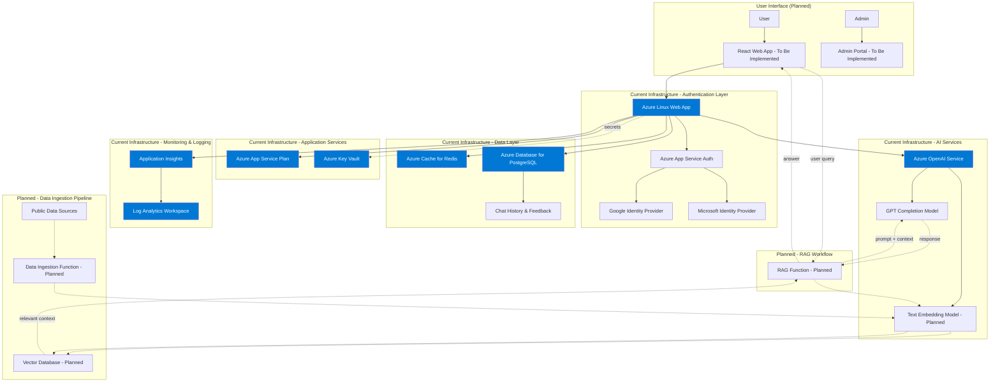

# AlpineBot _🇨🇭

AlpineBot is an AI-powered chatbot for everything Switzerland, presented with a minimalist and elegant design inspired by the provided image in the `inspiration` folder. The interface will feature a clean, airy aesthetic with a focus on white and light gray, and will use a large, high-quality background image of the Swiss Alps. To access the chatbot, users must authenticate using their Google or Microsoft accounts. The application includes an admin portal for full management of the application, including security, performance, data ingestion from live public data sources, and management of the LLM's instructions and behavior.

## Features 🚀

- **Swiss Public Data**: Real-time information about Switzerland from various public data sources.
- **AI-Powered**: Human-like responses via Azure OpenAI, using a Retrieval-Augmented Generation (RAG) architecture for up-to-date and accurate answers.
- **Secure Authentication**: Users can log in using their Google or Microsoft accounts.
- **Admin Portal**: A comprehensive admin portal for managing the application, including:
    - User management
    - Security settings
    - Performance monitoring
    - Data source management and ingestion
    - LLM instruction and behavior management
    - User feedback analysis
- **User Feedback**: Users can provide feedback on the chatbot's responses using a thumb up/thumb down voting system.
- **Real-Time Data Ingestion**: The ability to connect to live public data sources via API and ingest data regularly for up-to-date knowledge.
- **Multilingual**: Support for English, German, and French (coming soon).
- **Minimalist Design**: A clean, elegant, and user-friendly interface inspired by the provided image, featuring a large background image of the Swiss Alps and a light color palette.

## Getting Started ⛷️

### Prerequisites

> [!IMPORTANT]
> **NO LOCAL OPERATIONS**: Infrastructure deployment and management are handled **exclusively** via GitHub Actions. You do **NOT** need to install or run Terraform locally.

- Python 3.x, Azure Functions Core Tools (for local function development only)

### Installation

1. **Clone & Setup**:

   ```bash
   git clone https://github.com/fpittelo/alpinebot/ && cd AlpineBot
   # Ensure env vars are set: AZURE_OPENAI_KEY, OPENDATA_API_KEY (optional)
   ```

2. **Deploy**:

   Infrastructure deployment is managed exclusively through GitHub Actions. Pushing changes to the `dev` branch or merging pull requests into `qa` or `main` will trigger the automated deployment workflows.

## Project Structure 🗂️

- `/infra`: Terraform infrastructure as code (main configuration)
- `/modules`: Reusable Terraform modules for Azure services
  - `cognitive_account`: Azure OpenAI Service
  - `app_service_plan`: Azure App Service Plan
  - `linux_web_app`: Azure Web App with authentication
  - `redis_cache`: Azure Cache for Redis
  - `postgresql_db`: Azure Database for PostgreSQL
  - `key_vault`: Azure Key Vault
  - `log_analytics_workspace`: Log Analytics Workspace
- `/.github/workflows`: CI/CD pipeline definitions
- `/inspiration`: Design inspiration for the user interface
- `/frontend`: React app (planned)
- `/backend`: Azure Functions (planned)
- `/data`: Sample datasets (planned)

## Architecture 🏗️



## Development Process

This project follows an iterative development process and a Test-Driven Development (TDD) approach. All development will be done in small, manageable increments, with tests written before the code. All GitHub activities, such as issues, merges, and pull requests, will be documented. The documentation will be updated if any change occurs.

### Documentation Management

The project maintains several documentation files that must be kept up to date:

- **README.md**: Project overview, getting started guide, and architecture diagram
- **plan.md**: Development plan with milestones and task tracking
- **specs.md**: Detailed technical specifications
- **requirements.md**: Functional and non-functional requirements
- **CHANGELOG.md**: Version history and notable changes
- **CONTRIBUTING.md**: Contribution guidelines and development workflow

When making changes to the project, always update the relevant documentation files to reflect the current state of the project. The Mermaid diagram in README.md should be updated whenever the architecture changes.

## Contributing & License 📜

We welcome contributions! Please see our [Contributing Guide](CONTRIBUTING.md) for details on how to get started, our development process, and how to submit pull requests.

AlpineBot is MIT Licensed. See [LICENSE](LICENSE) for more information.

## Contact 📧

Open an issue if you need help. The Alps are waiting! 🏔️
