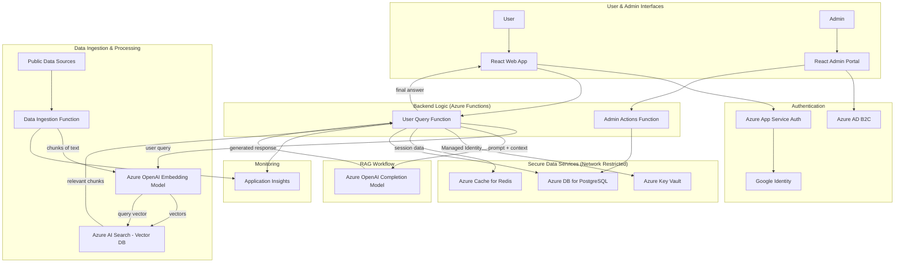

# AlpineBot \_🇨🇭

AlpineBot is an AI-powered chatbot for everything Switzerland, presented with a minimalist and elegant design. The interface features a clean, airy aesthetic with a focus on white and light gray. To access the chatbot, users authenticate exclusively with their Google accounts. The application includes an admin portal for full management of the application, including security, performance, data ingestion from live public data sources, and management of the LLM's instructions and behavior.

## Features 🚀

- **Swiss Public Data**: Real-time information about Switzerland from various public data sources.
- **AI-Powered**: Human-like responses via Azure OpenAI, using a Retrieval-Augmented Generation (RAG) architecture for up-to-date and accurate answers.
- **Secure Authentication**: Users sign in with Google using Azure App Service Authentication.
- **Admin Portal**: A comprehensive admin portal for managing the application, including:
  - User management
  - Security settings
  - Performance monitoring
  - Data source management and ingestion
  - LLM instruction and behavior management
  - User feedback analysis
- **User Feedback**: Users can provide feedback on the chatbot's responses using a thumb up/thumb down voting system.
- **Real-Time Data Ingestion**: The ability to connect to live public data sources via API and ingest data regularly for up-to-date knowledge.
- **Multilingual**: Support for English, German, and French (coming soon).
- **Minimalist Design**: A clean, elegant, and user-friendly interface and a light color palette.

## Getting Started ⛷️

### Prerequisites

> [!IMPORTANT] > **NO LOCAL OPERATIONS**: Infrastructure deployment and management are handled **exclusively** via GitHub Actions. You do **NOT** need to install or run Terraform locally.

- Python 3.x, Azure Functions Core Tools (for local function development only)
- **OAuth Application Setup Required**: Before the application can be accessed, you must configure a Google OAuth application and provide its credentials to the infrastructure workflows.

### Installation

1. **Clone & Setup**:

   ```bash
   git clone https://github.com/fpittelo/alpinebot/ && cd AlpineBot
   # Ensure env vars are set: AZURE_OPENAI_KEY, OPENDATA_API_KEY (optional)
   ```

2. **Configure OAuth Applications**:

   Before deploying, you must set up OAuth applications for authentication:

   - Create a Google OAuth application (Web type) and capture its Client ID and Client Secret
   - Configure the required GitHub secrets (`GOOGLE_CLIENT_ID`, `GOOGLE_CLIENT_SECRET`) with those values

3. **Deploy**:

   Infrastructure deployment is managed exclusively through GitHub Actions. The deployment consists of three main components:

   - **Infrastructure** (Terraform): Deploys all Azure resources including App Service Plan, Web App, OpenAI, Function App, databases, etc.
   - **Function App** (Backend): Deploys the Python Azure Functions backend that connects to Azure OpenAI
   - **Frontend** (React): Deploys the React web application

   Use the orchestrator workflow (`Deploy Full Environment`) to deploy all components, or individual workflows for specific components. Pushing changes to the `dev` branch or merging pull requests into `qa` or `main` will trigger the automated deployment workflows.

## Project Structure 🗂️

- `/frontend`: React app
- `/backend`: Azure Functions (Python 3.12)
- `/infra`: Infrastructure as Code (Terraform)
- `/modules`: Reusable Terraform modules
- `/data`: Sample datasets
- `/.github/workflows`: CI/CD pipelines

## Architecture 🏗️



## Security 🔒

- **Dynamic Secrets**: All sensitive credentials (e.g., OpenAI API Key) are stored in **Azure Key Vault** and accessed at runtime via **Managed Identities**. No secrets are hardcoded or exposed in configuration files.
- **Network Isolation**: Backend data services (Key Vault, PostgreSQL) are protected by **Network ACLs/Firewalls**, denying all public internet access and allowing only trusted Azure Services.
- **Authentication**: Strict OAuth 2.0 authentication via Google Identity for users and Azure AD B2C for admins.

## Development Process

This project follows an iterative development process and a Test-Driven Development (TDD) approach. All development will be done in small, manageable increments, with tests written before the code. All GitHub activities, such as issues, merges, and pull requests, will be documented. The documentation will be updated if any change occurs.

## Contributing & License 📜

We welcome PRs! AlpineBot is MIT Licensed.

## Contact 📧

Open an issue if you need help. The Alps are waiting! 🏔️
